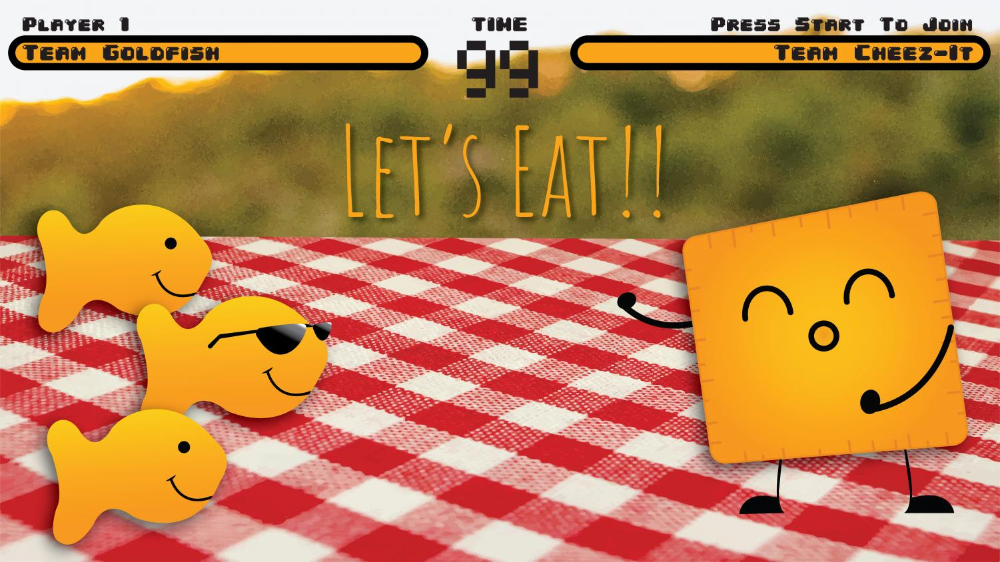

# {width="1000"}

```{r}
# Packages
library(tidyverse)
library(scales)
library(broom)

# Data
results = readxl::read_xlsx(here::here("whiteboardpollresults.xlsx")) %>%
  filter(question == "1") %>%
  mutate(share = votes / sum(votes)) %>%
  select(option, votes, share)

N = sum(results$votes)
```

# Well folks, its a tie. What can we glean from a boring 21-21 tie?

## Vote counts and shares

```{r}
#| label: fig-bar
#| fig-cap: "Votes and shares for each snack."
#| fig-width: 6
#| fig-height: 4
results |>
  ggplot(aes(x = fct_reorder(option, votes), y = votes, fill = option)) +
  geom_col(width = 0.65, show.legend = FALSE) +
  geom_text(aes(label = paste0(votes, " (", percent(share, accuracy = 0.1), ")")),
            vjust = -0.5, size = 4) +
  scale_y_continuous(expand = expansion(mult = c(0, 0.1))) +
  scale_fill_manual(values = c("#f8766d", "#00bfc4")) +
  labs(x = NULL, y = "Votes") +
  theme_minimal(base_size = 13)
```

## Inference: does anyone lead in the poll?

The natural null here is p = 0.5 for Cheez-Its, with N = 42

```{r}
bt <- binom.test(x = 21, n = 42, p = 0.5, alternative = "two.sided")
bt
```

The p-value is 1, a perfect tie gives no evidence either way. The 95% exact CI for the Cheez-Its share p is:

```{r}
ci_p <- bt$conf.int
ci_p
```

We can also express uncertainty for the vote-margin (Cheez-Its minus Goldfish share). Share margin = 2p - 1, the 95% CI for the margin is just 2 x CI(p) - 1:

```{r}
ci_margin <- 2 * ci_p - 1
ci_margin
```

## Probability of a tie if it really is a fair 50/50 world of Cheez-Its and Goldfish

If each of the 42 voters is a fair coin flip, the probability of a tie is:

```{r}
p_tie <- choose(N, N/2) / (2^N)
p_tie
```

That’s about `r percent(p_tie, accuracy = 0.1)`. Ties are not rare with samples this small.

## What margins should we expect with N = 42 at p = 0.5

Simulate many polls of the same size from a fair process and look at the margin in votes.

```{r}
#| label: fig-sim-margins
#| fig-cap: "Simulated vote margins if the true split is 50/50 (10,000 polls of size 42)."
#| fig-width: 7
#| fig-height: 4
M <- 10000
sim_cheez <- rbinom(M, size = N, prob = 0.5)
sim_margin_votes <- sim_cheez - (N - sim_cheez)  # Cheez - Goldfish in votes

tibble(margin_votes = sim_margin_votes) |>
  ggplot(aes(x = margin_votes)) +
  geom_histogram(binwidth = 2, fill = "#6aaed6", color = "white", boundary = 0) +
  geom_vline(xintercept = 0, linetype = "dashed") +
  scale_x_continuous(breaks = seq(-42, 42, by = 6)) +
  labs(x = "Vote margin (Cheez − Goldfish)", y = "Count of simulated polls") +
  theme_minimal(base_size = 13)
```

What fraction of simulated polls tie?

```{r}
mean(sim_margin_votes == 0)
```

## Likelihood and Bayesian view for the Cheez-Its share

The binomial likelihood for p given 21 successes in 42 trials:

```{r}
#| label: fig-likelihood
#| fig-cap: "Binomial likelihood L(p) for Cheez-Its share given 21/42."
#| fig-width: 6
#| fig-height: 4
p_grid <- seq(0, 1, length.out = 1001)
lik <- dbinom(21, size = 42, prob = p_grid)
lik <- lik / max(lik)  # scale for plotting

tibble(p = p_grid, likelihood = lik) |>
  ggplot(aes(p, likelihood)) +
  geom_line(color = "#333333", linewidth = 1) +
  geom_vline(xintercept = 0.5, linetype = "dotted") +
  labs(x = "Cheez-Its share (p)", y = "Relative likelihood (scaled)") +
  theme_minimal(base_size = 13)
```

If you use a flat prior Beta(1,1), the posterior is Beta(22,22). The 95% credible interval and posterior density:

```{r}
#| label: fig-posterior
#| fig-cap: "Posterior density for p with a Beta(1,1) prior (posterior = Beta(22,22))."
#| fig-width: 6
#| fig-height: 4

post_alpha <- 22
post_beta  <- 22
post_ci <- qbeta(c(0.025, 0.975), post_alpha, post_beta)

tibble(p = p_grid, density = dbeta(p_grid, post_alpha, post_beta)) |>
  ggplot(aes(p, density)) +
  geom_area(fill = "#b2df8a", alpha = 0.5) +
  geom_vline(xintercept = 0.5, linetype = "dotted") +
  annotate("rect",
           xmin = post_ci[1], xmax = post_ci[2],
           ymin = 0, ymax = Inf, alpha = 0.15, fill = "#1b9e77") +
  labs(x = "Cheez-Its share (p)", y = "Posterior density") +
  theme_minimal(base_size = 13)
```

The posterior probability that Cheez-Its leads (p > 0.5) under this symmetric prior is exactly 0.5.

```{r}
1 - pbeta(0.5, post_alpha, post_beta)
```

## Effect size: Cohen's h for proportions

Cohen’s h = 2asin(sqrt(p1)) − 2asin(sqrt(p2)). With p1 = p2 = 0.5, h = 0 (no effect).

```{r}
p1 <- results$share[results$option == "Cheez-Its"]
p2 <- results$share[results$option == "Goldfish"]
cohens_h <- 2*asin(sqrt(p1)) - 2*asin(sqrt(p2))
cohens_h
```

## Lets try a waffle chart (one square per vote)

```{r}
#| label: fig-waffle
#| fig-cap: "Waffle chart: 42 voters, split evenly."
#| fig-width: 6
#| fig-height: 4

# Build a simple waffle without extra packages
# 7 x 6 grid (42 cells)
rows <- 7
cols <- 6

waffle <- tibble(
  id = 1:N,
  option = rep(c("Cheez-Its", "Goldfish"), times = c(21, 21))
) |>
  mutate(
    row = (id - 1) %/% cols + 1,
    col = (id - 1) %% cols + 1
  )

waffle |>
  ggplot(aes(x = col, y = rows - row + 1, fill = option)) +
  geom_tile(color = "white", linewidth = 0.5, width = 0.95, height = 0.95) +
  scale_fill_manual(values = c("#f8766d", "#00bfc4")) +
  coord_equal() +
  labs(x = NULL, y = NULL) +
  theme_void() +
  theme(legend.position = "bottom")
```

# Takeaways

It’s a dead heat: 21–21 gives no evidence of a lead.

With N = 42 and a true 50/50 split, ties happen about r percent(p_tie, accuracy = 0.1) of the time.

The 95% interval for the Cheez-Its share is wide (reflecting a small sample).

If you repeat this poll weekly at the same size, expect margins to bounce around—even with no real preference.
