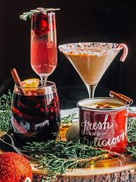

```{r}
library(tidyverse)
library(scales)

results = readxl::read_xlsx(here::here("whiteboardpollresults.xlsx")) %>%
  filter(question == "3") %>%
  mutate(share = votes/sum(votes)) %>%
  rename(drink = option)

N = sum(results$votes)
K = nrow(results)

# a small color palette
pal = c("Eggnog" = "#ffd375", "Mulled Wine" = "#310047",
         "Seasonal Beer" = "#613400", "Other" = "#90be6d")
```

# Apparently folks dont really like holiday beverages.

I, myself, really love eggnog (you should really try Alton Browns [Aged Eggnog](https://altonbrown.com/recipes/aged-eggnog/) Recipe)

## Poll Summary

-   "Other" is the single most popular choice, with 19 out of 38 votes (50%)

-   All named drinks (non-"Other") combined (Eggnog + Mulled Wine + Seasonal Beer) also add up to 19, so its a perfect split: Named = 19, Other = 19

-   Among the named drinks, Mulled Wine leads (10), followed by Eggnog (6), then Seasonal Beer (3)

This isnt a scientific poll, just a fun whiteboard vote, so think of these numbers as a snapshot of who happened to drop by the office this week. I'm going to hope that the other eggnog lovers at EPA were enjoying it on a holiday vacation somewhere.

## Vote counts and shares

```{r}
#| label: fig-bar
#| fig-cap: "Votes and shares for each holiday drink."
#| fig-width: 7
#| fig-height: 4
results %>%
  ggplot(aes(x = fct_reorder(drink, votes), y = votes, fill = drink)) +
  geom_col(width = 0.65, show.legend = FALSE) +
  geom_text(aes(label = paste0(votes, " (", percent(share, accuracy = 0.1), ")")),
            vjust = -0.5, size = 4) +
  scale_y_continuous(expand = expansion(mult = c(0, 0.1))) +
  scale_fill_manual(values = pal) +
  labs(x = NULL, y = "Votes") +
  theme_minimal(base_size = 13)
```

Now lets split the drinks into "named drinks" and "other":

```{r}
named_total = results %>% filter(drink != "Other") %>% summarise(votes = sum(votes)) %>% pull(votes)
other_total = results %>% filter(drink == "Other") %>% pull(votes)

tibble(group = c("Named (Eggnog + Mulled Wine + Seasonal Beer)", "Other"),
       votes = c(named_total, other_total),
       share = votes / N) %>%
  kableExtra::kable()
```

Named drinks total: `r named_total` (`r percent(named_total/N, accuracy = 0.1)`)

Other: `r other_total` (`r percent(other_total/N, accuracy = 0.1)`)

## Random wiggle, or a real pattern?

If people had no real preference and were equally likely to pick any option, would we often see a split as uneven as this?

-   If all four options were equally popular, we’d expect about 9–10 votes per option (38 total / 4 options).
-   Here we saw 19 for “Other” and just 3 for “Seasonal Beer,” which is quite uneven.

We can run a simple check (called a chi‑square test) that asks: “Are these numbers more uneven than we’d expect from random chance under a 25%‑each world?” It returns a p‑value. Think of it as “how surprising is this, if there were truly no differences?”

```{r}
#| label: chi-gof
gof = chisq.test(x = results$votes, p = rep(1/K, K))
gof
```

A small p‑value means “this pattern is hard to explain by chance if all options were equally liked.” If p is below about 0.05, most folks would say “there’s a real difference here.” In this poll, the p‑value is `r signif(gof$p.value, 4)`, which suggests the preferences are not equal across the four options.

Which options were most “surprising” relative to equal splits? Compare what we saw to what we’d expect (9.5 per option):

```{r}
#| label: resid-table
expected = rep(N / K, K)
std_resid = (results$votes - expected) / sqrt(expected)

tibble(
  drink = results$drink,
  observed = results$votes,
  expected = expected,
  standardized_difference = round(std_resid, 2)
) %>%
  arrange(desc(standardized_difference))
```

-   Positive numbers = above the equal‑share expectation (e.g., “Other”).
-   Negative numbers = below the equal‑share expectation (e.g., “Seasonal Beer”).

## How sure are we about each percentage?

If we repeated this whiteboard poll with a similar crowd, the exact numbers would bounce around. The dogs below show the observed share (%) for each drink. The horizontal lines show the 95% confidence interval (aka plausible ranges).

```{r}
#| label: fig-ci
#| fig-cap: "Share estimates with 95% confidence intervals for each category."
#| fig-width: 7
#| fig-height: 4.5
cis = results %>%
  rowwise() %>%
  mutate(
    # exact binomial 95% CI treating each drink as "this drink vs not-this-drink"
    ci = list(binom.test(votes, N)$conf.int),
    lower = ci[[1]],
    upper = ci[[2]]
  ) %>%
  ungroup()

cis %>%
  ggplot(aes(y = fct_reorder(drink, share), x = share, color = drink)) +
  geom_point(size = 2) +
  geom_errorbar(aes(xmin = lower, xmax = upper), height = 0.15) +
  scale_x_continuous(labels = percent_format(accuracy = 1)) +
  scale_color_manual(values = pal, guide = "none") +
  labs(x = "Share of votes", y = NULL) +
  theme_minimal(base_size = 13)
```

"Other" sits well above 25% and its plausible range stays high.

Seasonal Beer sits well below 25%.

Mulled Wine and Eggnog are in the middle, with Mulled Wine ahead of Eggnog in this sample.

## What if we ran the poll again next week?

Two quick, approachable views:

a)  If all options were truly equally popular, how often would “Other” land at 19 again? The chart below simulates many “equal‑preference” polls (everyone picks randomly among 4 options) and shows where “Other” would usually fall. The dashed line shows our observed 19.

```{r}
#| label: fig-other-null
#| fig-cap: "If all four options were equally popular (25% each), 'Other' would usually land near 9–10—not 19."
#| fig-width: 7
#| fig-height: 4
M = 10000
sim_other = rbinom(M, size = N, prob = 0.25)

tibble(other_votes = sim_other) %>%
  ggplot(aes(x = other_votes)) +
  geom_histogram(binwidth = 1, fill = "#8ecae6", color = "white", boundary = 0) +
  geom_vline(xintercept = 19, linetype = "dashed", color = pal[["Other"]]) +
  labs(x = "Other votes (under 25% each)", y = "Number of simulated polls") +
  theme_minimal(base_size = 13)
```

b)  If people’s true preferences looked like this week’s percentages, how often would “Other” be the top choice again? Below we simulate many re‑runs using this week’s percentages as a rough guide.

```{r}
#| label: fig-winner-sim
#| fig-cap: "Simulating repeat polls using this week's percentages. How often does each drink come out on top?"
#| fig-width: 7
#| fig-height: 4
p_hat = results$share
names(p_hat) = results$drink

# simulate many new polls and record the winner
M = 20000
draws = rmultinom(M, size = N, prob = p_hat)
winners = apply(draws, 2, function(counts) {
  drinks = results$drink
  drinks[which.max(counts)]
})
winner_share = prop.table(table(winners)) %>% as.data.frame()
colnames(winner_share) = c("drink", "prob")

ggplot(winner_share, aes(x = drink, y = prob, fill = drink)) +
  geom_col(width = 0.65, show.legend = FALSE) +
  scale_y_continuous(labels = percent_format(accuracy = 1), expand = expansion(mult = c(0, 0.05))) +
  scale_fill_manual(values = pal) +
  labs(x = NULL, y = "How often this drink wins (simulated)") +
  theme_minimal(base_size = 13)
```

In words, with this week’s pattern, “Other” would win most of the time in a same‑size rerun. Mulled Wine would sometimes take the top spot, Eggnog and Seasonal Beer would rarely do so at this size.

A handy “how many votes would need to change?” rule of thumb: to overtake the leader “Other” (19) with second‑place Mulled Wine (10), you’d need about 5 people to switch from “Other” to “Mulled Wine.” That would make “Other” 14 and “Mulled Wine” 15, flipping the lead.

## Weekly Waffle Chart

```{r}
#| label: fig-waffle
#| fig-cap: "Each square is one vote. Colors show how the 38 votes are distributed."
#| fig-width: 7
#| fig-height: 4
# Build a simple waffle without extra packages: 2 x 19 grid (38 cells)
rows = 2
cols = 19

waffle = results %>%
  arrange(desc(share)) %>%
  mutate(n = votes) %>%
  select(drink, n) %>%
  pmap(function(drink, n) tibble(drink = rep(drink, n))) %>%
  list_rbind() %>%
  mutate(id = row_number(),
         row = (id - 1) %/% cols + 1,
         col = (id - 1) %% cols + 1)

waffle %>%
  ggplot(aes(x = col, y = rows - row + 1, fill = drink)) +
  geom_tile(color = "white", linewidth = 0.5, width = 0.95, height = 0.95) +
  scale_fill_manual(values = pal) +
  coord_equal() +
  labs(x = NULL, y = NULL, fill = NULL) +
  theme_void() +
  theme(legend.position = "bottom")
```

# Takeaways

-   "Other" is the clear single-category favorite, matching the combined total of the three named drinks
-   The "everyone likes all options equally" idea doesn't fit this data at all, there are clear winners we'd expect to win if the poll was conducted again
-   [***People really need to try better eggnog, not the swill that they sell at grocery stores in cartons***]{.underline}


