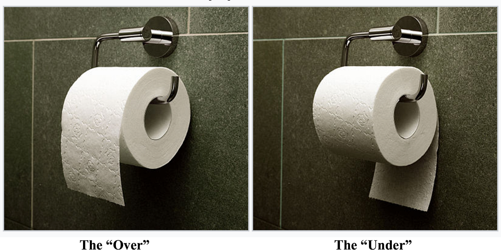

```{r}
library(tidyverse)
library(scales)

results = readxl::read_xlsx(here::here("whiteboardpollresults.xlsx")) %>%
  filter(question == "4") %>%
  mutate(share = votes / sum(votes))

N = sum(results$votes)
over_share  = results$share[results$option == "Over"]
under_share = results$share[results$option == "Under"]
margin_votes = results$votes[results$option == "Over"] - results$votes[results$option == "Under"]
margin_share = over_share - under_share

# Basic test vs 50/50 for "Over"
bt = binom.test(x = results$votes[results$option == "Over"], n = N, p = 0.5)
```



# WE GOT IT RIGHT! There is an objectively correct and incorrect answer here, and we resoundingly were on the right side of history.

## Quick Look

Over: `r results$votes[results$option == "Over"]` votes (`r percent(over_share, accuracy = 0.1)`) Under: `r results$votes[results$option == "Under"]` votes (`r percent(under_share, accuracy = 0.1)`) Margin: `r margin_votes` votes (≈ `r percent(margin_share, accuracy = 0.1)` points)

```{r}
#| label: fig-bar
#| fig-cap: "Counts and shares."
#| fig-width: 6
#| fig-height: 4
pal = c("Over" = "#4CAF50", "Under" = "#FA3737")

results %>%
  ggplot(aes(x = fct_reorder(option, votes), y = votes, fill = option)) +
  geom_col(width = 0.65, show.legend = FALSE) +
  geom_text(aes(label = paste0(votes, " (", percent(share, accuracy = 0.1), ")")),
            vjust = -0.5, size = 4) +
  scale_y_continuous(expand = expansion(mult = c(0, 0.1))) +
  scale_fill_manual(values = pal) +
  labs(x = NULL, y = "Votes") +
  theme_minimal(base_size = 13)
```

## Basic Stats

Is this different from a 50/50 split? Yes. Exact binomial test p‑value = `r signif(bt$p.value, 3)`.

“Over” share 95% CI: `r sprintf("[%.2f, %.2f]", bt$conf.int[1], bt$conf.int[2])`.

How many voters would need to switch to change the winner? Because each switch changes the margin by 2, you’d need 9 people to switch from Over to Under to flip the result. A perfect tie isn’t possible with 25 voters.

## Waffle Chart

```{r}
#| label: fig-waffle
#| fig-cap: "Each square is one vote (25 total)."
#| fig-width: 6
#| fig-height: 4
rows = 5
cols = 5  # 5 x 5 = 25 cells

waffle = tibble(
  id = 1:N,
  option = c(rep("Over", results$votes[results$option == "Over"]),
             rep("Under", results$votes[results$option == "Under"]))
) %>%
  mutate(
    row = (id - 1) %/% cols + 1,
    col = (id - 1) %% cols + 1
  )

waffle %>%
  ggplot(aes(x = col, y = rows - row + 1, fill = option)) +
  geom_tile(color = "white", linewidth = 0.5, width = 0.95, height = 0.95) +
  scale_fill_manual(values = pal) +
  coord_equal() +
  labs(x = NULL, y = NULL, fill = NULL) +
  theme_void() +
  theme(legend.position = "bottom")
```
