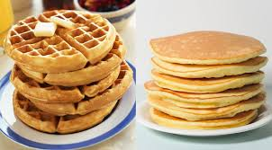

```{r}
library(tidyverse)
library(scales)

results = readxl::read_xlsx(here::here("whiteboardpollresults.xlsx")) %>%
  filter(question %in% c("5","6"))

# Data
poll_wp = tibble(
  question = "Waffles vs Pancakes",
  option   = c("Waffles", "Pancakes"),
  votes    = c(10, 17)
) %>%
  mutate(share = votes / sum(votes),
         N = sum(votes))

poll_ss = tibble(
  question = "Sweet vs Savory",
  option   = c("Sweet", "Savory"),
  votes    = c(8, 13)
) %>%
  mutate(share = votes / sum(votes),
         N = sum(votes))

# Helper: summarize a two-option poll
summarize_two_option = function(df) {
  stopifnot(nrow(df) == 2)
  N = df$N[1]
  lead_row = df %>% arrange(desc(votes)) %>% slice(1)
  trail_row = df %>% arrange(desc(votes)) %>% slice(2)

  # Exact binomial test vs 50/50 for the leader
  bt = binom.test(x = lead_row$votes, n = N, p = 0.5, alternative = "two.sided")

  tibble(
    question       = df$question[1],
    N              = N,
    leader         = lead_row$option,
    leader_votes   = lead_row$votes,
    leader_share   = lead_row$share,
    trailer        = trail_row$option,
    trailer_votes  = trail_row$votes,
    trailer_share  = trail_row$share,
    margin_votes   = lead_row$votes - trail_row$votes,
    margin_share   = lead_row$share - trail_row$share,
    p_value_50_50  = bt$p.value,
    ci_lower       = bt$conf.int[1],
    ci_upper       = bt$conf.int[2],
    # With an odd N, a perfect tie is impossible. Flips to change winner:
    flips_to_flip  = floor((lead_row$votes - trail_row$votes)/2) + 1L
  )
}

sum_wp = summarize_two_option(poll_wp)
sum_ss = summarize_two_option(poll_ss)

# bind_rows(sum_wp, sum_ss) 
```



# This week we ask two questions about breakfast foods, *Pancakes or Waffles* and *Sweet or Savory*?

## Pancakes vs. Waffles

```{r}
#| label: fig-wp-bar
#| fig-cap: "Waffles vs Pancakes — counts and shares (N = 27)."
#| fig-width: 6
#| fig-height: 4
pal_wp = c("Waffles" = "#A0522D", "Pancakes" = "#F4A261")

poll_wp %>%
  ggplot(aes(x = fct_reorder(option, votes), y = votes, fill = option)) +
  geom_col(width = 0.65, show.legend = FALSE) +
  geom_text(aes(label = paste0(votes, " (", percent(share, 0.1), ")")),
            vjust = -0.5, size = 4) +
  scale_y_continuous(expand = expansion(mult = c(0, 0.1))) +
  scale_fill_manual(values = pal_wp) +
  labs(x = NULL, y = "Votes") +
  theme_minimal(base_size = 13)
```

```{r}
#| label: fig-wp-waffle
#| fig-cap: "Waffle chart: one square per vote (3×9 grid)."
#| fig-width: 6
#| fig-height: 4
rows = 3
cols = 9  # 3 x 9 = 27 cells

wp_waffle = tibble(
  id = 1:poll_wp$N[1],
  option = c(rep("Pancakes", poll_wp$votes[poll_wp$option=="Pancakes"]),
             rep("Waffles",  poll_wp$votes[poll_wp$option=="Waffles"]))
) %>%
  mutate(
    row = (id - 1) %/% cols + 1,
    col = (id - 1) %% cols + 1
  )

wp_waffle %>%
  ggplot(aes(x = col, y = rows - row + 1, fill = option)) +
  geom_tile(color = "white", linewidth = 0.5, width = 0.95, height = 0.95) +
  scale_fill_manual(values = pal_wp) +
  coord_equal() +
  labs(x = NULL, y = NULL, fill = NULL) +
  theme_void() +
  theme(legend.position = "bottom")
```

## Sweet vs. Savory

```{r}
#| label: fig-ss-bar
#| fig-cap: "Sweet vs Savory — counts and shares (N = 21)."
#| fig-width: 6
#| fig-height: 4
pal_ss = c("Sweet" = "#ff70aa", "Savory" = "#734730")

poll_ss %>%
  ggplot(aes(x = fct_reorder(option, votes), y = votes, fill = option)) +
  geom_col(width = 0.65, show.legend = FALSE) +
  geom_text(aes(label = paste0(votes, " (", percent(share, 0.1), ")")),
            vjust = -0.5, size = 4) +
  scale_y_continuous(expand = expansion(mult = c(0, 0.1))) +
  scale_fill_manual(values = pal_ss) +
  labs(x = NULL, y = "Votes") +
  theme_minimal(base_size = 13)
```

```{r}
#| label: fig-ss-waffle
#| fig-cap: "Waffle chart: one square per vote (3×7 grid)."
#| fig-width: 6
#| fig-height: 4
rows = 3; 
cols = 7  # 3 x 7 = 21 cells
ss_waffle = tibble(
  id = 1:poll_ss$N[1],
  option = c(rep("Savory", poll_ss$votes[poll_ss$option=="Savory"]),
             rep("Sweet",  poll_ss$votes[poll_ss$option=="Sweet"]))
) %>%
  mutate(
    row = (id - 1) %/% cols + 1,
    col = (id - 1) %% cols + 1
  )

ss_waffle %>%
  ggplot(aes(x = col, y = rows - row + 1, fill = option)) +
  geom_tile(color = "white", linewidth = 0.5, width = 0.95, height = 0.95) +
  scale_fill_manual(values = pal_ss) +
  coord_equal() +
  labs(x = NULL, y = NULL, fill = NULL) +
  theme_void() +
  theme(legend.position = "bottom")
```

## Poll Summary

Waffles vs Pancakes (N = `r sum_wp$N`): Pancakes lead `r sum_wp$leader_votes`–`r sum_wp$trailer_votes` (about `r percent(sum_wp$leader_share, 0.1)` vs `r percent(sum_wp$trailer_share, 0.1)`).

Sweet vs Savory (N = `r sum_ss$N`): Savory leads `r sum_ss$leader_votes`–`r sum_ss$trailer_votes` (about `r percent(sum_ss$leader_share, 0.1)` vs `r percent(sum_ss$trailer_share, 0.1)`).

In this week’s group, both questions leaned roughly 60/40 toward Pancakes and toward Savory.

## Basic Stats

Lets check “is this clearly more than 50/50?” and “how big is the lead?”

```{r} 
#| label: summary-table 

bind_rows(sum_wp, sum_ss) %>%
  transmute(
    question,
    N,
    `Leader (votes)` = sprintf("%s (%d)", leader, leader_votes),
    `Trailer (votes)` = sprintf("%s (%d)", trailer, trailer_votes),
    `Leader share`   = percent(leader_share, 0.1),
    `Margin (votes)` = margin_votes,
    `Margin (points)` = percent(margin_share, 0.1),
    `p vs 50/50`     = signif(p_value_50_50, 3),
    `Leader 95% CI`  = sprintf("[%.2f, %.2f]", ci_lower, ci_upper),
    `Votes to flip winner` = flips_to_flip
  ) %>%
  kableExtra::kable()
```

-   “p vs 50/50” is the two‑sided p‑value from an exact test; small values (like \< 0.05) suggest the winner’s share is clearly above 50% in this sample.
-   “Leader 95% CI” is a plausible range for the leader’s true share if you repeated this kind of poll many times.
-   “Votes to flip winner” is the minimum number of people who’d need to switch from the leader to the trailer to change the outcome (a perfect tie isn’t possible here because both polls have an odd number of votes).

## Both polls at a glance

Here’s a simple “leader share with 95% interval” for each question. It’s a quick way to see that both polls show a similar lean (roughly 60–65% for the winner).

```{r}
#| label: fig-leader-ci
#| fig-cap: "Leader share with 95% confidence intervals for each poll."
#| fig-width: 6
#| fig-height: 3.8
leaders = bind_rows(sum_wp, sum_ss) %>%
  transmute(question, leader, leader_share, lower = ci_lower, upper = ci_upper)

leaders %>%
  ggplot(aes(y = fct_rev(question), x = leader_share, color = question)) +
  geom_point(size = 2) +
  geom_errorbarh(aes(xmin = lower, xmax = upper), height = 0.15) +
  scale_x_continuous(labels = percent_format(accuracy = 1), limits = c(0, 1)) +
  labs(x = "Leader's share of votes", y = NULL) +
  theme_minimal(base_size = 13) +
  theme(legend.position = "none")
```

Is there a connection between the two questions?

Short answer: we can’t directly tell, because we didn’t collect matched responses (i.e., we don’t know which Pancakes voters also picked Savory). But we can say a couple of useful things:

-   A quick bound, assuming the 21 Sweet/Savory voters were also among the 27 Waffles/Pancakes voters:
    -   Pancakes + Savory overlap could be anywhere from 3 to 13 of those 21 people (14% to 62%).
    -   Waffles + Sweet could be anywhere from 0 to 8 of those 21 people (0% to 38%).
    -   Why these ranges? They’re just the largest and smallest overlaps that are mathematically possible given the totals (17 Pancakes, 10 Waffles; 13 Savory, 8 Sweet).
-   A “what‑if” check: If choices were independent (people pick Pancakes/Waffles and Sweet/Savory without a link), we’d expect roughly
    -   Pancakes + Savory ≈ 39% of the overlapped voters (about 8 of 21)
    -   Waffles + Sweet ≈ 14% (about 3 of 21). These sit comfortably inside the feasible ranges above.

Here’s a small visualization of those ranges, with a dot showing the “independent choices” expectation.

```{r}
#| label: fig-connection-bounds
#| fig-cap: "Feasible ranges if the 21 Sweet/Savory voters are a subset of the 27 Waffles/Pancakes voters. Dots show a simple 'independent choices' expectation."
#| fig-width: 7
#| fig-height: 4
# Totals
N_wp = poll_wp$N[1]      # 27
N_ss = poll_ss$N[1]      # 21
m    = N_ss              # assume the 21 S/S voters are in the W/P group

pancakes_total = poll_wp$votes[poll_wp$option=="Pancakes"]  # 17
waffles_total  = poll_wp$votes[poll_wp$option=="Waffles"]   # 10
savory_total   = poll_ss$votes[poll_ss$option=="Savory"]    # 13
sweet_total    = poll_ss$votes[poll_ss$option=="Sweet"]     # 8

# Min/max number of Pancakes voters inside any subset of size m from the 27 W/P voters
exclude = N_wp - m  # how many W/P voters are not in the overlap
a_min = max(0, pancakes_total - exclude)   # = 11
a_max = min(pancakes_total, m)             # = 17

# Bounds for overlaps among the m overlapped voters
min_PS = max(0, a_min + savory_total - m)  # Pancakes & Savory minimum = 3
max_PS = min(a_max, savory_total)          # Pancakes & Savory maximum = 13

# Do the same for Waffles & Sweet
w_min = max(0, waffles_total - exclude)    # = 4
w_max = min(waffles_total, m)              # = 10
min_WS = max(0, w_min + sweet_total - m)   # = 0
max_WS = min(w_max, sweet_total)           # = 8

# Convert to shares of the overlapped m voters
df_bounds = tibble(
  combo = c("Pancakes + Savory", "Waffles + Sweet"),
  min_share = c(min_PS/m, min_WS/m),
  max_share = c(max_PS/m, max_WS/m)
)

# Simple independence expectation (using observed shares)
p_pan = pancakes_total / N_wp
p_waf = 1 - p_pan
p_sav = savory_total / N_ss
p_swt = 1 - p_sav

df_bounds$expected_share = c(p_pan * p_sav, p_waf * p_swt)

ggplot(df_bounds, aes(y = combo)) +
  geom_segment(aes(x = min_share, xend = max_share, yend = combo),
               size = 4, color = "#c7e9c0") +
  geom_point(aes(x = expected_share), size = 3, color = "#1b9e77") +
  scale_x_continuous(labels = percent_format(accuracy = 1), limits = c(0, 1)) +
  labs(x = "Share of overlapped voters", y = NULL) +
  theme_minimal(base_size = 13)
```

Both polls tilt toward Pancakes and toward Savory. If many people answered both, we’d expect “Pancakes + Savory” to be more common than “Waffles + Sweet,” but the exact relationship needs matched responses to confirm. These two polls were taken in succession, not simultaneously. Different people may have voted in each question
